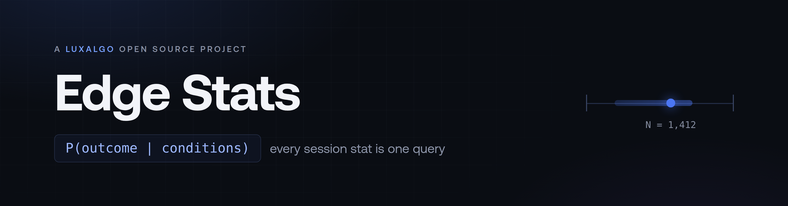
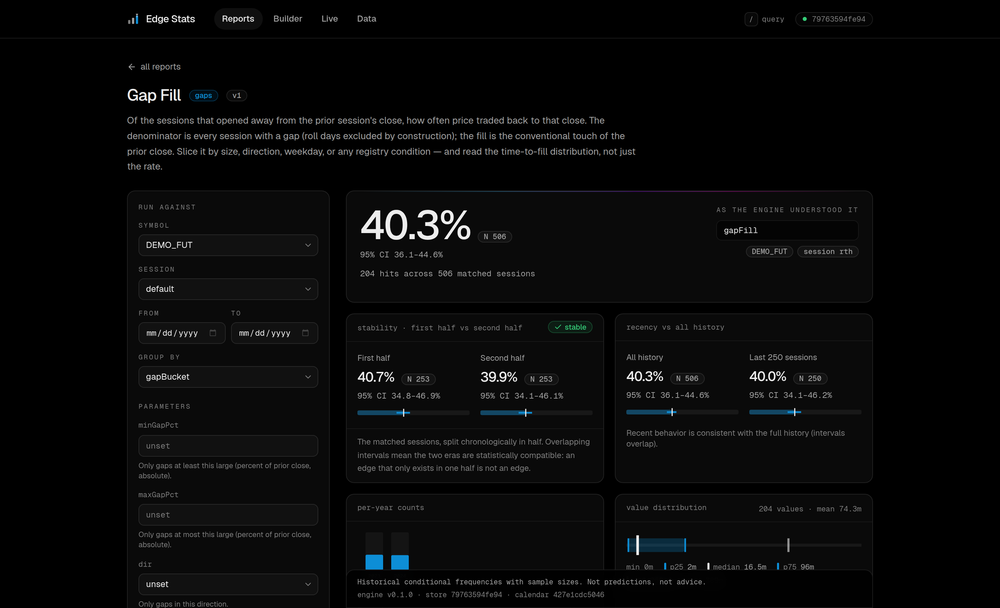
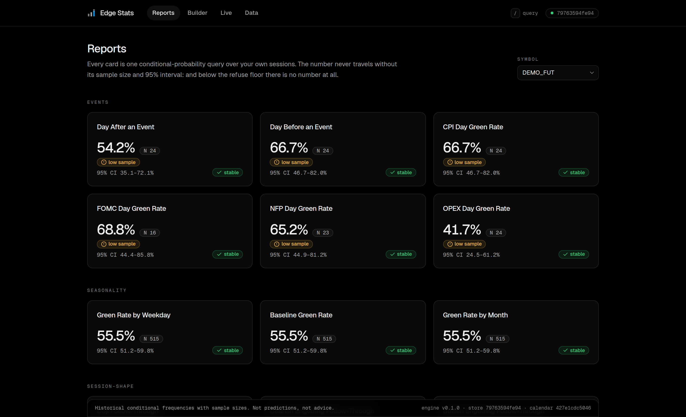
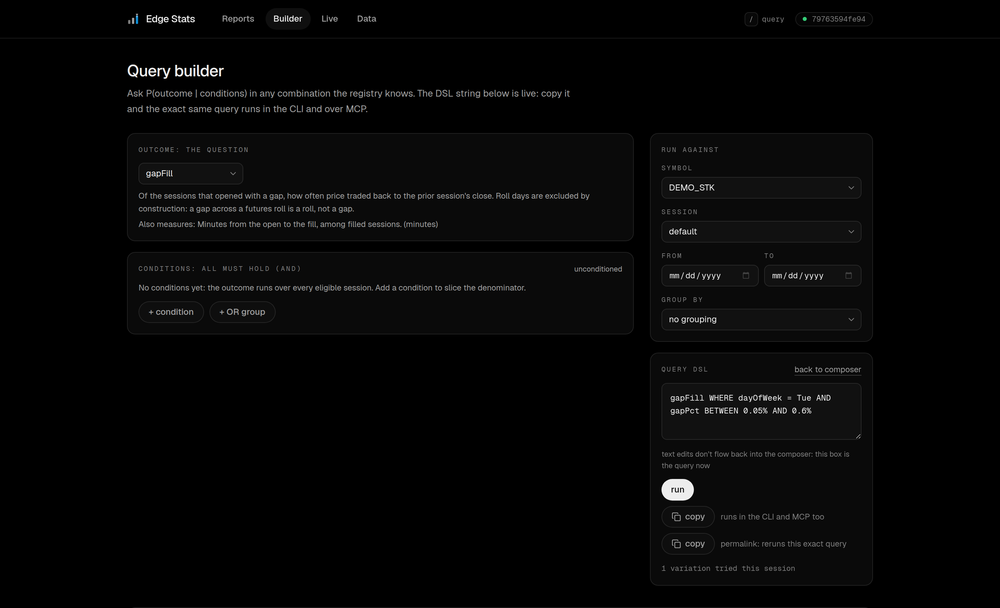

<p align="center">
  
</p>

<p align="center">
  Composable session statistics over your own market data.<br>
  <code>P(outcome | conditions)</code>, with the sample size and confidence interval attached to every estimate.
</p>

<p align="center">
  <a href="#quickstart">Quickstart</a> ·
  <a href="docs/catalog.md">Catalog</a> ·
  <a href="docs/data-sources.md">Data sources</a> ·
  <a href="#mcp">MCP</a> ·
  <a href="ARCHITECTURE.md">Architecture</a>
</p>

<p align="center">
  <a href="https://github.com/LuxAlgo/edge-stats/actions/workflows/ci.yml"></a>
  <a href="https://github.com/LuxAlgo/edge-stats/actions/workflows/adapter-canaries.yml"></a>
  <a href="https://github.com/LuxAlgo/edge-stats/actions/workflows/calendar-freshness.yml"></a>
  <a href="LICENSE"></a>
</p>

Edge Stats is a [LuxAlgo](https://www.luxalgo.com) open source project. Official repository: [github.com/LuxAlgo/edge-stats](https://github.com/LuxAlgo/edge-stats).

---

Edge Stats syncs intraday bars from your own data source into a local DuckDB store, derives session features once, and answers conditional-probability queries over them. Any outcome in the registry composes with any set of conditions, so the report catalog is a folder of preset queries rather than a fixed menu. It ships as a CLI, a local dashboard, and an MCP server; all three run the same engine and return the same result envelope.

```
$ edgestats query "gapFill WHERE dayOfWeek = Tue AND gapPct BETWEEN 0.05% AND 0.6%" --symbol DEMO_STK

gapFill WHERE dayOfWeek = Tue AND gapPct BETWEEN 0.05% AND 0.6%
  DEMO_STK · rth · start → latest

  estimate 80.0%   N = 30   95% CI [62.7%, 90.5%]   (24 hits)
  stability: 86.7% (n=15) vs 73.3% (n=15) · halves agree ✓
  distribution (minutes, n=24): median 3 · p25 0 · p75 31 · p90 157
  per-year: 2023 88.2% (17) · 2024 69.2% (13)

  Historical conditional frequencies with sample sizes. Not predictions, not advice.
```

## Quickstart

The demo store is deterministic synthetic data; no keys, no external services.

```bash
git clone https://github.com/LuxAlgo/edge-stats && cd edge-stats
pnpm install
pnpm edgestats init --demo        # ~900k synthetic bars, derived in seconds
pnpm edgestats query "gapFill WHERE dayOfWeek = Tue" --symbol DEMO_STK
pnpm edgestats report gap-fill --symbol DEMO_FUT --group gapBucket
pnpm edgestats serve              # dashboard + API on localhost
```

For real data, `edgestats adapters` lists every source and the env keys each one reads. Keys are read from your environment and never logged or sent anywhere else.

## Dashboard

<p align="center">
  
</p>

<p align="center">
  
  
</p>

Report cards, a query builder that shows the live DSL string, per-report filter pages, a live board, and drill-down from any number to the sessions behind it. The full query is encoded in the URL, so any view can be shared and reproduced.

## Statistical honesty

Every result carries the same envelope, in the CLI, the dashboard, the API, and over MCP:

- the point estimate with N and a Wilson 95% confidence interval
- minimum-sample guards: a warning below 30 sessions, no estimate below 10
- a first-half vs second-half stability split, and a recency view (last 250 sessions vs full history)
- per-year counts, and the value distribution for continuous outcomes
- the normalized query echoed back, with drill-down to the matching sessions
- a fixed disclaimer: historical frequencies, not predictions

There is no code path that prints a percentage without its sample size.

## Session calendars

Session boundaries are computed in exchange time through the IANA timezone database, and DST transitions are covered by test fixtures. Holiday and half-day calendars are versioned data files with cited sources and coverage horizons checked by CI. Overnight futures sessions settle on the correct trade date, and futures roll days are flagged and excluded from gap statistics by construction. Details in [docs/session-calendars.md](docs/session-calendars.md) and [docs/continuous-futures.md](docs/continuous-futures.md).

## Data sources

Edge Stats computes on data you already have or license. Every adapter normalizes into the same local store; [docs/data-sources.md](docs/data-sources.md) documents each path.

| Adapter     | Covers                               | Vendor cost                            | Env keys                             |
| ----------- | ------------------------------------ | -------------------------------------- | ------------------------------------ |
| `csv`       | Anything you can export to a file    | none                                   | none                                 |
| `synthetic` | Deterministic demo bars              | none                                   | none                                 |
| `binance`   | Binance spot crypto, full 1m history | free, keyless                          | none                                 |
| `coinbase`  | Coinbase Exchange crypto, 1m candles | free, keyless                          | none                                 |
| `alpaca`    | US equities and ETFs, 1m bars        | free tier (IEX feed)                   | `ALPACA_KEY_ID`, `ALPACA_SECRET_KEY` |
| `databento` | CME futures, continuous 1m           | pay as you go, with a capped preflight | `DATABENTO_API_KEY`                  |
| `massive`   | Massive flat files from disk         | covered by your existing subscription  | none for flat files                  |

The `csv` adapter covers anything not listed: if your source can export a file, Edge Stats can compute on it. A daily [adapter-canaries](.github/workflows/adapter-canaries.yml) workflow pulls a small sample from each vendor and fails on schema drift.

## MCP

`@luxalgo/edge-stats-mcp` (stdio and streamable HTTP) exposes the engine to agents through eight read-only tools:

| Tool                | Returns                                                             |
| ------------------- | ------------------------------------------------------------------- |
| `edge_freshness`    | Configured symbols, last bar per symbol, calendar versions          |
| `edge_fields`       | The registry: every outcome, predicate, and field, with definitions |
| `edge_query`        | Any composed P(outcome given conditions), in the full envelope      |
| `edge_report`       | A preset from the catalog, with parameters                          |
| `edge_reports_list` | The catalog, with parameter specs                                   |
| `edge_sessions`     | The historical sessions behind a result                             |
| `edge_live`         | Live Board state: forming, active, and resolved setups              |
| `edge_export`       | CSV or parquet written locally, path returned                       |

Typical flow: `edge_freshness`, then `edge_fields`, then `edge_query`, then `edge_sessions` for the underlying sessions.

## Presets

A preset is one JSON file: an outcome, base conditions, parameters, and definition prose with citations into the [LuxAlgo Library](https://www.luxalgo.com/library/). The generated [catalog](docs/catalog.md) lists 42 presets across 11 categories (121 named variants), and anything the query language can express works without one. Adding a report is a pull request with one file.

## Comparison with Edgeful

<!-- comparison facts last verified 2026-08-25 via public search extracts; re-verify before major releases -->

[Edgeful](https://edgeful.com) is the best-known commercial product in this category. The comparison is nominative and factual. Their figures come from public third-party reviews as of 2026-08 (daytradingz.com, bullishbears.com), not from their site, which this project does not ingest; treat their column as a snapshot and their website as the authority. Every Edge Stats claim is verifiable in this repository.

|                             | Edgeful (as of 2026-08)                                         | Edge Stats                                                                           |
| --------------------------- | --------------------------------------------------------------- | ------------------------------------------------------------------------------------ |
| Model                       | Hosted web platform; computation on their servers               | Local engine; your bars, your DuckDB file, your disk                                 |
| Price                       | $49/mo (or $468/yr); algo and API tier at $299/mo; no free tier | MIT; you pay only your own data vendor                                               |
| Reports                     | 150+ pre-built reports                                          | 42 presets (121 named variants), plus any query you can compose                      |
| Filters                     | Per-report filter menus                                         | Every registry predicate composes with every outcome                                 |
| What travels with a number  | Report percentages; methodology presentation is theirs to state | N, Wilson 95% CI, minimum-sample guards, stability splits, enforced                  |
| History                     | 5+ years standard, 8 years top tier, per third-party reviews    | Your data source decides: full crypto history, CME futures depth, any CSV            |
| Tickers                     | 3,000+ assets on their hosted list                              | Whatever your source serves; CSV covers the rest                                     |
| Export                      | Not advertised in the public material we reviewed               | `edgestats export`: CSV or parquet of bars, sessions, events, or any query's matches |
| Programmatic access         | API access included with the $299/mo tier                       | Local MCP server (8 tools) and a local HTTP API                                      |
| Alerts                      | Screener and alerts across their main strategies                | Live Board: threshold and minimum-N alerts on any composed query, replayable         |
| Calendars and futures rolls | Not documented in the public material we reviewed               | Versioned, cited, CI-checked calendars; roll days excluded from gap stats            |
| License                     | Proprietary subscription                                        | MIT                                                                                  |

[docs/coming-from-edgeful.md](docs/coming-from-edgeful.md) maps the classic session-statistics reports to their preset ids.

## Non-goals

- No order execution and no broker connections.
- No tick streaming; session statistics need bars.
- No hosted service, no telemetry, no accounts.
- No scraping of any other product's site or app. The statistics here are generic, well-known trading math, implemented independently from public definitions.
- No predictions and no advice: historical conditional frequencies with sample sizes.

## Development

```bash
pnpm install
pnpm test:run        # golden sessions, calendar edge cases, DSL, stats: 196 tests
pnpm typecheck && pnpm --filter @luxalgo/edge-stats-web typecheck
pnpm lint --max-warnings 0
pnpm edgestats --dir .ci-demo init --demo && pnpm edgestats --dir .ci-demo bench
```

[ARCHITECTURE.md](ARCHITECTURE.md) covers the system design. [CONTRIBUTING.md](CONTRIBUTING.md) covers adding presets, predicates, and adapters, and the review ground rules.

## License

Code is [MIT](LICENSE). The calendar and event data files under `data/` are additionally usable under [CC BY 4.0](DATA_LICENSE) with attribution to LuxAlgo. The dashboard bundles the Geist fonts under the [SIL OFL 1.1](packages/web/public/fonts/OFL.txt). See [TRADEMARKS.md](TRADEMARKS.md) for name and logo use, and [SECURITY.md](SECURITY.md) for private vulnerability reporting.
